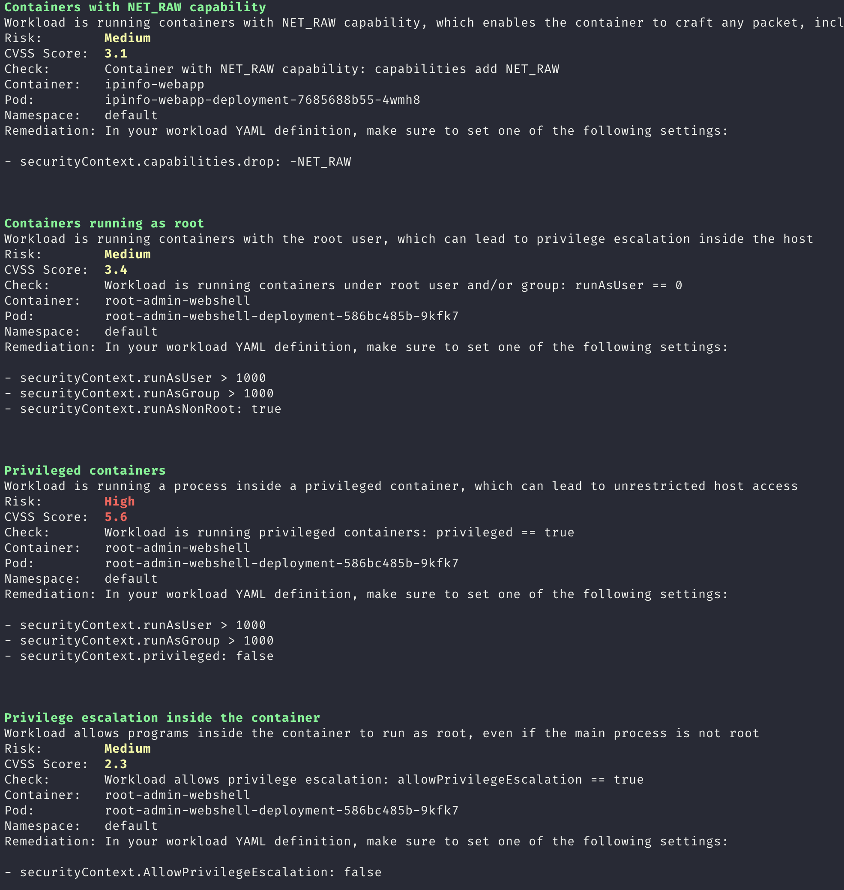

<h1 align="center">
  Kubnerable 
</h1>

<a href="https://goreportcard.com/report/github.com/javiln8/kubnerable"></a>


Kubnerable is an out-cluster vulnerability scanner tool for Kubernetes resources. It comes with a predefined vulnerability 
database (`vulnerabilities.yaml`) with basic pod weaknesses checks.

For testing purposes, there is a Kind setup for bootstrapping a cluster with vulnerable predefined scenarios. For more info,
check the following [README](kubnerable_cluster/README.md).

*This project was done as part of my Master's Thesis and as an excuse to learn Go from scratch 🐹*

## Features

* Out-cluster resource vulnerabilities scanning
  * Needs a valid Kubeconfig file with read access
* Correlates vulnerabilities with risk and CVSS score
* Allows custom vulnerabilities or checks

## Usage
```
❯ ./kubnerable -h
Kubnerable scans all pods and containers of a Kubernetes cluster in search of exploitable vulnerabilities

Usage:
  kubnerable [flags]

Examples:
kubnerable -f ../vulnerabilities.yaml

Flags:
  -h, --help               help for kubnerable
  -f, --vuls-file string   Vulnerabilities YAML file path, needed for scanning (default "../vulnerabilities.yaml")
```
